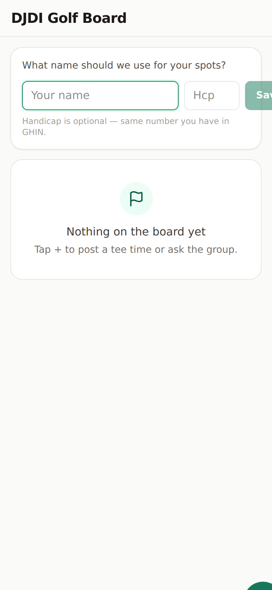
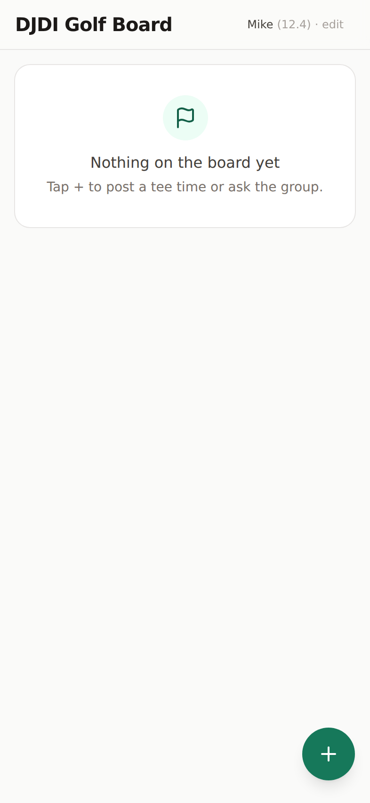
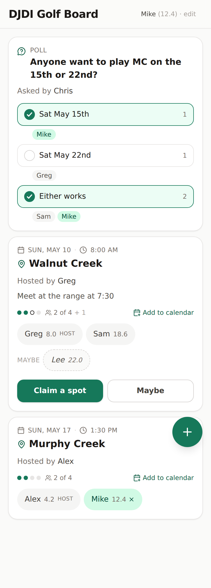
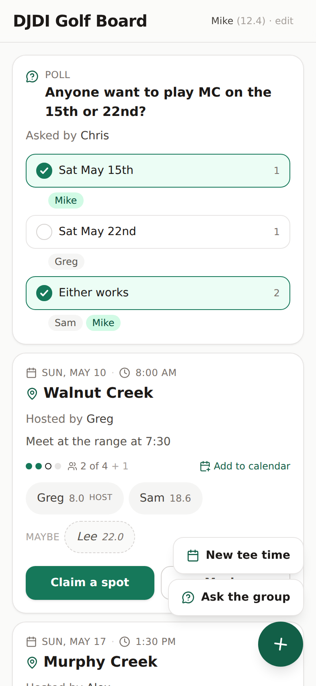
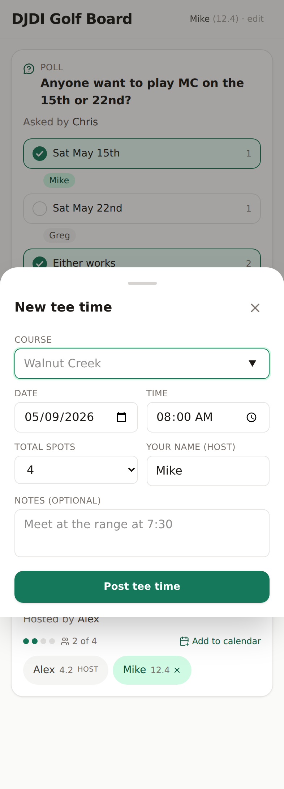
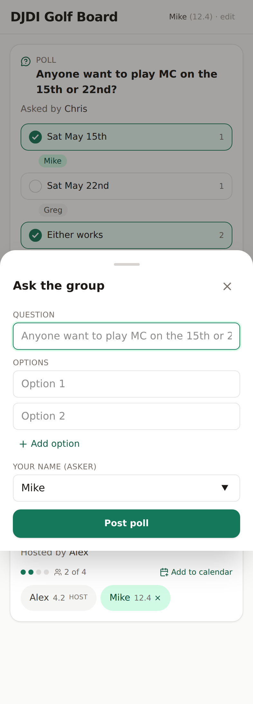
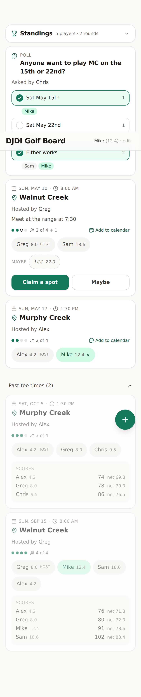
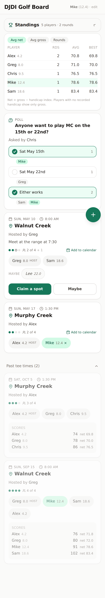
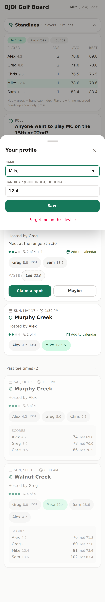

# DJDI Golf Board — Screenshots

Real screenshots of the running app, captured at iPhone 14 Pro viewport
(393 × 852 @ 2x) by [`scripts/screenshots.ts`](./scripts/screenshots.ts) via
Playwright. The script boots the production build (`NODE_ENV=production
npx tsx server.ts` after `npm run build`), seeds a fixture set of
players, tee times, polls, and past scores via the public API, and drives
the UI through each state.

To regenerate after UI changes:

```bash
npm install --no-save playwright   # only if not already installed
npm run build
NODE_ENV=production npx tsx server.ts &
PLAYWRIGHT_BROWSERS_PATH=/opt/pw-browsers npx tsx scripts/screenshots.ts
```

---

## 1. Empty board, no profile

First-time landing. The name prompt asks for a name plus an optional
handicap (same number you have in GHIN). Below it is the empty-state
card with the flag icon.



## 2. Empty board, profile set

After saving, the prompt disappears and the header shows
"Mike (12.4) · edit" — the whole pill is the tap target for opening
the profile sheet.



## 3. Populated board

Top-down: Standings card (collapsed by default once there are scores in
the system), poll card, then upcoming tee-time cards. Each player chip
shows the handicap inline ("Greg 8.0", "Sam 18.6"). The maybe row
shows "Lee 22.0" in dashed-italic style. Equal-width Claim/Maybe peers.



## 4. FAB chooser open

The `+` rotates to `×` and reveals two stacked pills — "New tee time"
and "Ask the group" — each on a single line.



## 5. New tee time bottom sheet

Form: course (with autocomplete from past entries), date + time, total
spots + host, optional notes. Native iOS-style date/time pickers.



## 6. New poll bottom sheet ("Ask the group")

Question + dynamic 2-8 options + asker. Each option row has its own
remove `X` (only after the minimum 2 are present).



## 7. Past tee times expanded

Past cards render at `opacity-60`. When scores have been recorded for
the round, a **Scores** block appears below the chips listing each
player's gross + net (gross − handicap), sorted by net (lowest first).
Past chips are not interactive — no `X` on your own chip, no rose
hover.



## 8. Standings expanded

Aggregates every recorded score into a per-player leaderboard.
Sortable by Avg net (default), Avg gross, or Rounds. Best column shows
best-net or best-gross to match the active sort. Current user's row
gets a fairway-50 highlight. Players with no recorded handicap fall to
the bottom under the Avg net sort and show only gross stats.



## 9. Profile sheet

Name + Handicap (GHIN index, optional, -10 to +54). Saves both
locally (so the device remembers) and globally (so every chip in the
group can show the index). "Forget me on this device" clears the
local copy without touching the server record.


