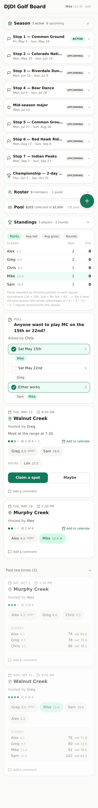
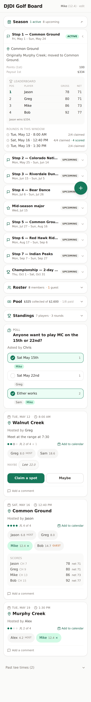
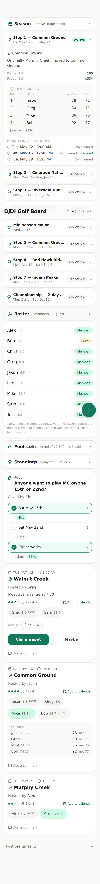
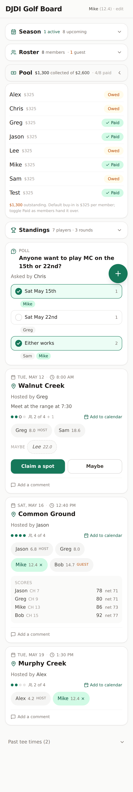
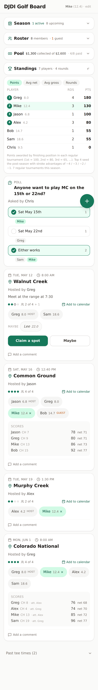
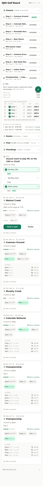

# DJDI Golf Board — Screenshots

Real screenshots of the running app, captured at iPhone 14 Pro viewport
(393 × 852 @ 2x) by [`scripts/screenshots.ts`](./scripts/screenshots.ts) via
Playwright. The script boots the production build (`NODE_ENV=production
npx tsx server.ts` after `npm run build`), seeds a fixture set of
players, tee times, polls, scores, and tournaments via the public API,
and drives the UI through each state.

To regenerate after UI changes:

```bash
npm install --no-save playwright   # only if not already installed
npm run build
NODE_ENV=production npx tsx server.ts &
PLAYWRIGHT_BROWSERS_PATH=/opt/pw-browsers npx tsx scripts/screenshots.ts
```

---

## 1. Empty board, no profile

First-time landing. The name prompt asks for a name plus an optional
handicap (same number you have in GHIN). Below it is the empty-state
card with the flag icon.


## 2. Empty board, profile set

After saving, the prompt disappears and the header shows
"Mike (12.4) · edit" — the whole pill is the tap target for opening
the profile sheet.


## 3. Populated board

Season schedule (collapsed), Roster, Standings, polls, tee-time cards.
Each player chip shows the handicap inline ("Greg 8.0", "Sam 18.6").
The maybe row shows "Lee 22.0" in dashed-italic style. Equal-width
Claim/Maybe peers.


## 4. FAB chooser open

The `+` rotates to `×` and reveals two stacked pills — "New tee time"
and "Ask the group" — each on a single line.


## 5. New tee time bottom sheet

Form: course (with autocomplete from past entries), date + time, total
spots + host, optional notes.


## 6. New poll bottom sheet ("Ask the group")

Question + dynamic 2-8 options + asker. Each option row has its own
remove `X` (only after the minimum 2 are present).


## 7. Past tee times expanded

Past cards render at `opacity-60`. When scores have been recorded for
the round, a **Scores** block appears below the chips listing each
player's gross + net (gross − handicap), sorted by net (lowest first).


## 8. Standings expanded

Aggregates every recorded score into a per-player leaderboard.
Sortable by Avg net (default), Avg gross, or Rounds. Current user's
row gets a fairway-50 highlight.


## 9. Profile sheet

Name + Handicap (GHIN index, optional, -10 to +54). Saves both
locally (so the device remembers) and globally (so every chip in the
group can show the index). Saving auto-promotes you to a member.


## 11. Season schedule expanded

The full 2026 league schedule, seeded from the rule sheet **with the
Common Ground change**. Each tournament shows status (active /
upcoming / past), course, date range, and type icon (Flag / Star /
Trophy). Tap any to expand.



## 12. Tournament expanded — leaderboard + rounds

Stop 1 expanded: course note + payouts + per-tournament leaderboard
(Pos · Player · Gross · Net, sorted by net) with a "Jason wins $334"
footer, plus the list of rounds in the window with claimed/scored
counts.



## 13. Roster expanded

Every name that's appeared on the board, with a **Member**/**Guest**
toggle pill per row. Members count toward the season; guests are
drop-in players. Names without a profile yet show "no profile" until
they save handicap info.



## 14. Pool / buy-in tracker

Header summarizes the prize pool ("$975 collected of $2,275 · 3/7
paid"). Each member row toggles between **Paid** (green checkmark)
and **Owed** (amber). Footer shows outstanding amount; default
buy-in is $325 from the rule sheet. Buy-in rows are auto-created on
member-promotion and deleted on demotion.



## 15. Standings sorted by season points

The new default Standings view. Points are awarded by finishing
position in each regular tournament (1st = 100, 2nd = 80, 3rd = 65,
… following the FedEx-Cup-style table). The top 4 by points get a
small fairway-green seed badge next to their name — that's the
projected post-season seeding. Notice the Common Ground card below
shows the round that fed these points, and the Colorado National
card shows the league-attested scores ("att. Greg", "att. Alex").



## 16. Post-season bracket

Championship tournament card expanded. Renders a sum-based
leaderboard with seed badges (1..4) and stroke advantages (−4/−3/−2/−1)
applied to the running net. Total column shows the adjusted score.
Footer declares the payout winners ($1,014 / $390 / $156). When no
post-season rounds are posted yet, the bracket shows the locked-in
seeds and what stroke advantage they'll start at.



